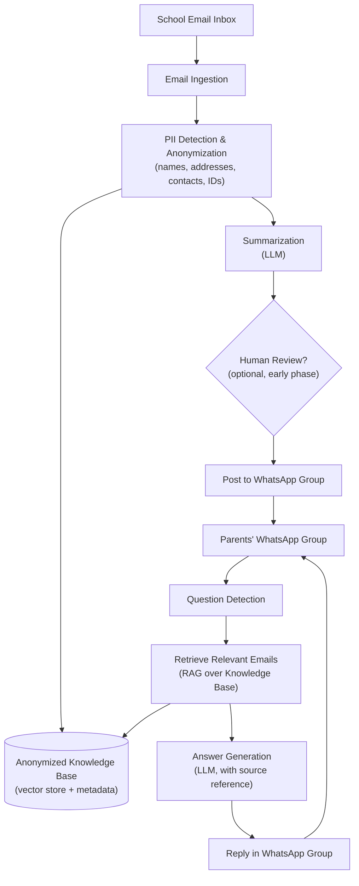
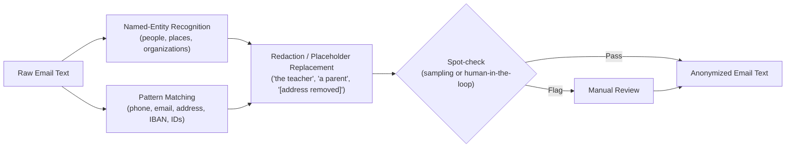
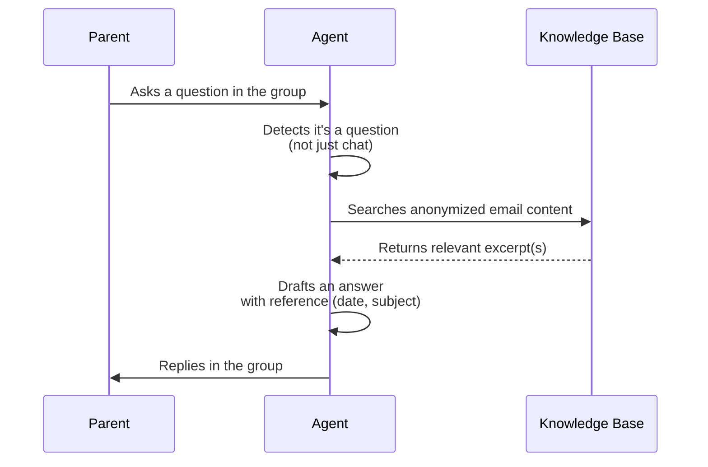

# Email-to-WhatsApp Privacy Agent for School Communication

> **Concept with formal requirements** — A privacy-preserving bridge between official school emails and the parents' WhatsApp group

## 📌 At a Glance

| | |
|---|---|
| **Type** | Concept with a full functional & non-functional requirements set (pre-MVP) |
| **Problem space** | School communicates only via email; parents are actually active in WhatsApp |
| **Core function** | Anonymize school emails → post to WhatsApp group → answer follow-up questions from the group |
| **Target users** | Parents in an existing school WhatsApp group |
| **Privacy approach** | Personal data (names, addresses, contacts, etc.) is removed before anything is shared |
| **Requirements quality score** | 80 / 100 (3 review iterations) |
| **Status** | Requirements defined — no implementation yet |

---

## ❓ What

The school only communicates officially through **email**, but most parents already coordinate through an existing **WhatsApp group**. Important information sent by email is frequently missed, arrives too late, or never reaches everyone — while the WhatsApp group is where parents actually pay attention.

The idea is an **agent that bridges both channels safely**:

1. It reads incoming school emails.
2. It **anonymizes** them — removing names, addresses, and other personal data.
3. It posts a clear, anonymized summary into the parents' WhatsApp group.
4. It also **listens to the WhatsApp group** and answers parents' follow-up questions, using the content of the school emails as its knowledge source.

In short: the school keeps using the channel it insists on (email), while parents get the information where they actually look (WhatsApp) — without private data leaking into a less controlled group chat.

This concept has since been refined into a concrete set of **functional requirements (user stories)** and **non-functional requirements**, reviewed against INVEST criteria and ISO/IEC 25010 — see below.

---

## 🤔 Why

### The communication gap
- The school refuses to adopt a dedicated parent-communication app and only sends information by email.
- Many parents don't check email regularly, or miss time-sensitive notices (e.g. event changes, deadlines, payment requests).
- The parents already have a working communication channel — a WhatsApp group — but it isn't fed by the school directly.

### Why not just forward the emails as-is?
Simply forwarding or photographing emails into the group would leak personal data into a chat that:
- has many members with no formal confidentiality obligation,
- often includes parents the family may not know well,
- may include children's names, addresses, contact details of staff or other families — data covered by GDPR and subject to extra protection because it concerns minors.

An **anonymization step is therefore not a nice-to-have, it's the core requirement** that makes this idea viable at all.

### Why add a Q&A capability?
Once the school's information already lives in a structured, anonymized knowledge base, it's a small additional step to let the same agent answer parents' questions ("When exactly is the deadline mentioned in last week's email?") directly in the group — instead of someone re-reading old emails or pinging the class representative.

---

## 🛠️ How

### High-level architecture

### Anonymization step in detail

### Question-answering flow in the group

### Core components

| Component | Responsibility |
|---|---|
| **Email Ingestion** | Connects to a dedicated mailbox (forwarding rule or shared inbox) and picks up new school emails |
| **PII Detection & Anonymization** | Removes/replaces names, addresses, phone numbers, emails, and other identifiers before any content leaves this step |
| **Summarization** | Turns the anonymized email into a short, WhatsApp-friendly message |
| **Knowledge Base** | Stores anonymized email content with metadata (date, subject, sender role) for later retrieval |
| **WhatsApp Posting** | Sends the summary into the parents' group |
| **Question Detection** | Distinguishes genuine questions from regular group chat |
| **Retrieval & Answering (RAG)** | Finds the relevant anonymized email(s) and drafts an answer with a source reference |

---

## 📋 Functional Requirements (User Stories)

All stories are written from the perspective of the **Privacy Agent** (the system acting as an actor) or the **Parent**, and each carries explicit acceptance criteria.

| # | User Story | Actor | Goal | Key Acceptance Criteria |
|---|---|---|---|---|
| 1 | Store anonymized emails in the knowledge base | Privacy Agent | Keep relevant information available for later queries | Stored with metadata (date, subject, sender role); retention is limited and entries are deletable on request |
| 2 | Summarize emails | Privacy Agent | Let parents grasp the key information quickly | A short, understandable summary is created; suitable for WhatsApp |
| 3 | Post summaries to the WhatsApp group | Privacy Agent | Inform all parents promptly | Only anonymized summaries are posted; human review precedes auto-posting in the initial phase; every post gets an audit trail |
| 4 | Anonymize emails | Privacy Agent | Prevent sensitive information from reaching the group | PII (names, addresses, contacts, other identifiers) is fully removed or replaced; children's data is anonymized especially strictly; original texts are never forwarded |
| 5 | Answer parents' questions in the group | Privacy Agent | Give parents fast answers to school-related questions | Detects questions in the group; answers rely solely on anonymized email content; answers include a source reference (date, subject) |
| 6 | Ensure ease of use for parents | Parent | Get information without needing extra systems | All relevant information and answers are delivered exclusively via the WhatsApp group |
| 7 | Log all answers | Privacy Agent | Ensure traceability and the ability to correct mistakes | All answers to parent questions are logged |
| 8 | Ensure data minimization | Privacy Agent | Preserve privacy | Only anonymized and relevant content is ever forwarded |
| 9 | Read school emails | Privacy Agent | Process relevant school messages for parents | Reads incoming emails from the dedicated mailbox; only emails from the school are processed |
| 10 | Delete data on request | Privacy Agent | Let parents keep control over their data | Stored anonymized emails are deleted on request |
| 11 | Audit trail for posted messages | Privacy Agent | Make all activity traceable | Every post gets an audit trail entry |
| 12 | Human review of anonymization in the initial phase | Privacy Agent | Ensure anonymization quality before trusting automation | A person reviews every anonymized summary before posting during the initial phase |
| 13 | Obtain parental consent to use the agent | Privacy Agent | Guarantee privacy compliance and acceptance | Parents are actively informed about the agent; usage only proceeds after explicit parental consent |
| 14 | Automate information processing | Privacy Agent | Keep the process scalable and efficient | Processing and forwarding become automated once anonymization quality is assured |
| 15 | Limit the data retention period | Privacy Agent | Avoid storing unnecessary data | Retention period for anonymized emails is limited |

---

## 🛡 Non-Functional Requirements (ISO/IEC 25010)

| Category | Requirements |
|---|---|
| **Performance** | Handle at least 100 concurrent user requests/minute in the WhatsApp chat · Max. 5-second response time for posting messages and answering questions |
| **Availability** | ≥ 99.5% monthly average uptime · Recovery within 1 hour (RTO) on failure · Max. 15 minutes of data loss (RPO) on failure |
| **Security** | Strong authentication for the admin interface · Role-based access control for admin/operational functions · Encrypt all personal data at rest and in transit · Guarantee no personal data (especially of minors) reaches the WhatsApp chat · Protect anonymization logic and audit logs against tampering |
| **Usability** | Traceable source reference (date, subject) on every automated answer and posted message · Clear, unambiguous error messages for users and admins · Consistent operating logic for configuration and monitoring |
| **Scalability** | Horizontally scalable for a growing number of emails and WhatsApp groups · Handle load spikes (e.g. start of school year) without functional loss |
| **Maintainability** | Versioned API for email/WhatsApp interface integration · Anonymization rules and retention periods configurable without restart · Anonymization-logic changes deployable without full outage · Structured logging and diagnostics for every processing step |
| **Reliability** | Structured error handling for faulty emails, WhatsApp messages, and anonymization errors · Fallback to manual review on detection failures · Consistency of anonymized data in the knowledge base · Monitoring of all core processes (ingestion, anonymization, posting, Q&A) |
| **Compliance** | Full GDPR compliance for processing, storage, and deletion of personal data · Complete audit trail for all posted messages and answers · Opt-in required from all parents before use · Technically enforced retention limits and deletion on request · EU AI Act compliance for transparency, traceability, and risk management |

---

## 📊 Requirements Quality Analysis

An AI-assisted requirements review scored this requirement set **80 / 100** after **3 review iterations**.

**INVEST scores (aggregated across all user stories):**

| Independent | Negotiable | Valuable | Estimable | Small | Testable |
|---|---|---|---|---|---|
| 80% | 80% | 95% | 78% | 74% | 82% |

### ✅ Strengths
- All user stories are scored against INVEST criteria, consistently good to very good.
- Every story has clear, testable acceptance criteria.
- Stories are independent, valuable, and mostly small enough to implement directly.
- Core processes and privacy requirements are covered comprehensively.
- Non-functional requirements were derived explicitly and systematically.

### ⚠️ Weaknesses / Limitations
- Some stories could be split further (a few score only 0.7 on "Small").
- Some acceptance criteria are fairly general (e.g. what exactly counts as an "understandable summary").
- Edge-case stories are missing — e.g. handling emails that can't be anonymized, or explicit parental opt-out.
- Not all user roles and their rights/processes are modeled as stories.
- The boundary between "Privacy Agent" and "System" (automation) isn't always sharply drawn.

### 🧾 Missing User Stories
- Onboarding/offboarding process for new parents or privacy agents
- Handling error cases, e.g. when an email cannot be anonymized
- Accessibility and multilingual support
- Integration with other systems or data sources
- Detailed permission management for different user groups

### 🤔 Open Decisions
- How are conflicting parent requests handled (e.g. withdrawal of consent)?
- How is quality assurance handled once the initial human-review phase ends?
- How are updates to anonymization rules communicated and technically rolled out?
- How is multilingual support or adaptation to different school types handled?

### 🛡 Missing Non-Functional Requirements
- No explicit accessibility requirement
- No explicit multilingual requirement
- No explicit backup/restore requirements beyond RTO/RPO
- No explicit description of monitoring/alerting processes for administrators

### 🚀 Recommended Next Steps
- Add user stories for onboarding/offboarding and error cases.
- Refine acceptance criteria on existing stories.
- Add accessibility and multilingual requirements.
- Work out detailed permission management and role concepts.
- Define processes for consent withdrawal and other edge cases.
- Extend non-functional requirements with monitoring, alerting, and backup/restore details.

---

## 🔒 Privacy & Safety Design

This idea only works if privacy is treated as the central design constraint, not an afterthought:

- **Data minimization** — only anonymized summaries are ever posted; original emails are never forwarded or quoted verbatim.
- **Special care for minors' data** — children's names, classes, and any identifying details get the strictest redaction rules.
- **Human-in-the-loop at the start** — early on, a person should review/approve each anonymized message before it's posted, until the anonymization quality is proven reliable.
- **Audit trail** — every posted message and every answer should be logged with a link back to the (anonymized) source, so mistakes can be traced and corrected.
- **Opt-in, not silent rollout** — parents in the group should explicitly agree that an agent will post on their behalf and answer questions.
- **Retention limits** — define how long anonymized emails are kept in the knowledge base, and delete on request.
- **No school-side integration required** — the school's email system isn't modified; the agent only reads what it's given via a normal mailbox/forwarding rule.

---

## 🧰 Suggested Tech Stack

| Need | Possible building blocks |
|---|---|
| Email ingestion | IMAP polling or a forwarding rule into a dedicated mailbox |
| PII detection | NER model (e.g. spaCy or an LLM-based extractor) + regex for structured data (phone, email, IBAN) |
| Summarization & Q&A | An LLM (e.g. via an API) with a RAG setup over the anonymized knowledge base |
| Vector store | A lightweight vector database (e.g. FAISS, Chroma) |
| WhatsApp integration | WhatsApp Business Platform API (preferred for compliance) or a bot framework |
| Logging / audit | Simple structured log store (e.g. database table per posted message) |

---

## 🗺️ Suggested MVP Roadmap

1. **Read-only pilot** — agent reads emails and anonymizes them, but a human still posts the summary manually (validate anonymization quality).
2. **Auto-posting with review** — agent posts automatically but every message is logged and reviewed after the fact (covers User Stories #3, #11, #12).
3. **Add Q&A** — agent starts answering parents' questions in the group, always citing the (anonymized) source email (User Story #5, #7).
4. **Full automation** — once trust and anonymization accuracy are proven, remove the manual review step (User Story #14).

---

## ❗ Open Questions & Risks

- How reliable does anonymization need to be before it's safe to fully automate posting?
- Who is accountable if the agent anonymizes something incorrectly or answers a question wrong?
- Does the school need to be informed or involved, even if it isn't required to do anything technical?
- How are WhatsApp's terms of service and the WhatsApp Business API's compliance requirements affected by this use case?
- What happens to the knowledge base (and group members' questions) when a child leaves the school?
- How are conflicting requests (e.g. consent withdrawal) and non-anonymizable emails handled? *(flagged by the requirements review as an open decision)*

---

## ✅ Key Takeaways

| # | Takeaway |
|---|---|
| 1 | **Anonymization is the core feature**, not an add-on — without it, the whole idea is not viable |
| 2 | **Bridge, don't replace** — the school keeps emailing, parents keep using WhatsApp; the agent connects the two |
| 3 | **Start with human review** — trust in the anonymization should be earned before going fully autonomous |
| 4 | **RAG turns old emails into a help desk** — parents get answers without digging through their inbox |
| 5 | **The requirements are solid but not complete** — score 80/100, with clear gaps around onboarding, accessibility, multilingual support, and edge-case handling |
