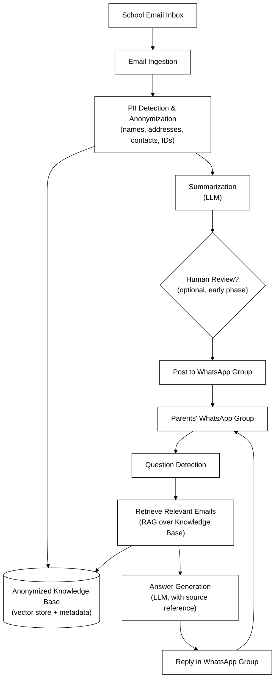
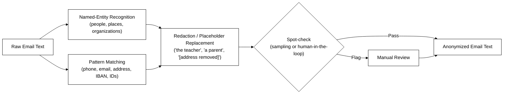
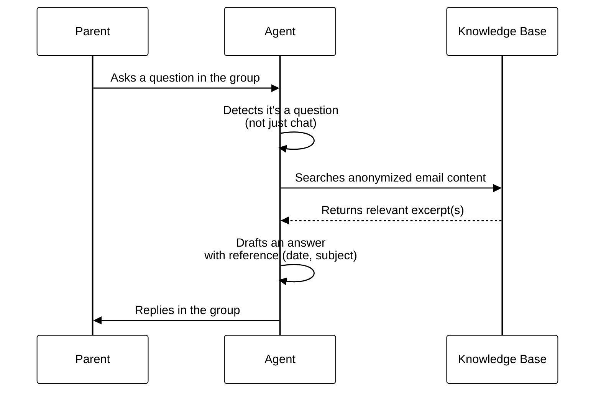

# Email-to-WhatsApp Privacy Agent for School Communication

> **Concept / Idea Draft** — A privacy-preserving bridge between official school emails and the parents' WhatsApp group

## 📌 At a Glance

| | |
|---|---|
| **Type** | Concept / idea draft (pre-MVP) |
| **Problem space** | School communicates only via email; parents are actually active in WhatsApp |
| **Core function** | Anonymize school emails → post to WhatsApp group → answer follow-up questions from the group |
| **Target users** | Parents in an existing school WhatsApp group |
| **Privacy approach** | Personal data (names, addresses, contacts, etc.) is removed before anything is shared |
| **Status** | Idea stage — no implementation yet |

---

## ❓ What

The school only communicates officially through **email**, but most parents already coordinate through an existing **WhatsApp group**. Important information sent by email is frequently missed, arrives too late, or never reaches everyone — while the WhatsApp group is where parents actually pay attention.

The idea is an **agent that bridges both channels safely**:

1. It reads incoming school emails.
2. It **anonymizes** them — removing names, addresses, and other personal data.
3. It posts a clear, anonymized summary into the parents' WhatsApp group.
4. It also **listens to the WhatsApp group** and answers parents' follow-up questions, using the content of the school emails as its knowledge source.

In short: the school keeps using the channel it insists on (email), while parents get the information where they actually look (WhatsApp) — without private data leaking into a less controlled group chat.

---

## 🤔 Why

### The communication gap
- The school refuses to adopt a dedicated parent-communication app and only sends information by email.
- Many parents don't check email regularly, or miss time-sensitive notices (e.g. event changes, deadlines, payment requests).
- The parents already have a working communication channel — a WhatsApp group — but it isn't fed by the school directly.

### Why not just forward the emails as-is?
Simply forwarding or photographing emails into the group would leak personal data into a chat that:
- has many members with no formal confidentiality obligation,
- often includes parents the family may not know well,
- may include children's names, addresses, contact details of staff or other families — data covered by GDPR and subject to extra protection because it concerns minors.

An **anonymization step is therefore not a nice-to-have, it's the core requirement** that makes this idea viable at all.

### Why add a Q&A capability?
Once the school's information already lives in a structured, anonymized knowledge base, it's a small additional step to let the same agent answer parents' questions ("When exactly is the deadline mentioned in last week's email?") directly in the group — instead of someone re-reading old emails or pinging the class representative.

---

## 🛠️ How

### High-level architecture

### Anonymization step in detail

### Question-answering flow in the group

### Core components

| Component | Responsibility |
|---|---|
| **Email Ingestion** | Connects to a dedicated mailbox (forwarding rule or shared inbox) and picks up new school emails |
| **PII Detection & Anonymization** | Removes/replaces names, addresses, phone numbers, emails, and other identifiers before any content leaves this step |
| **Summarization** | Turns the anonymized email into a short, WhatsApp-friendly message |
| **Knowledge Base** | Stores anonymized email content with metadata (date, subject, sender role) for later retrieval |
| **WhatsApp Posting** | Sends the summary into the parents' group |
| **Question Detection** | Distinguishes genuine questions from regular group chat |
| **Retrieval & Answering (RAG)** | Finds the relevant anonymized email(s) and drafts an answer with a source reference |

---

## 🔒 Privacy & Safety Design

This idea only works if privacy is treated as the central design constraint, not an afterthought:

- **Data minimization** — only anonymized summaries are ever posted; original emails are never forwarded or quoted verbatim.
- **Special care for minors' data** — children's names, classes, and any identifying details get the strictest redaction rules.
- **Human-in-the-loop at the start** — early on, a person should review/approve each anonymized message before it's posted, until the anonymization quality is proven reliable.
- **Audit trail** — every posted message and every answer should be logged with a link back to the (anonymized) source, so mistakes can be traced and corrected.
- **Opt-in, not silent rollout** — parents in the group should explicitly agree that an agent will post on their behalf and answer questions.
- **Retention limits** — define how long anonymized emails are kept in the knowledge base, and delete on request.
- **No school-side integration required** — the school's email system isn't modified; the agent only reads what it's given via a normal mailbox/forwarding rule.

---

## 🧰 Suggested Tech Stack

| Need | Possible building blocks |
|---|---|
| Email ingestion | IMAP polling or a forwarding rule into a dedicated mailbox |
| PII detection | NER model (e.g. spaCy or an LLM-based extractor) + regex for structured data (phone, email, IBAN) |
| Summarization & Q&A | An LLM (e.g. via an API) with a RAG setup over the anonymized knowledge base |
| Vector store | A lightweight vector database (e.g. FAISS, Chroma) |
| WhatsApp integration | WhatsApp Business Platform API (preferred for compliance) or a bot framework |
| Logging / audit | Simple structured log store (e.g. database table per posted message) |

---

## 🗺️ Suggested MVP Roadmap

1. **Read-only pilot** — agent reads emails and anonymizes them, but a human still posts the summary manually (validate anonymization quality).
2. **Auto-posting with review** — agent posts automatically but every message is logged and reviewed after the fact.
3. **Add Q&A** — agent starts answering parents' questions in the group, always citing the (anonymized) source email.
4. **Full automation** — once trust and anonymization accuracy are proven, remove the manual review step.

---

## ❗ Open Questions & Risks

- How reliable does anonymization need to be before it's safe to fully automate posting?
- Who is accountable if the agent anonymizes something incorrectly or answers a question wrong?
- Does the school need to be informed or involved, even if it isn't required to do anything technical?
- How are WhatsApp's terms of service and the WhatsApp Business API's compliance requirements affected by this use case?
- What happens to the knowledge base (and group members' questions) when a child leaves the school?

---

## ✅ Key Takeaways

| # | Takeaway |
|---|---|
| 1 | **Anonymization is the core feature**, not an add-on — without it, the whole idea is not viable |
| 2 | **Bridge, don't replace** — the school keeps emailing, parents keep using WhatsApp; the agent connects the two |
| 3 | **Start with human review** — trust in the anonymization should be earned before going fully autonomous |
| 4 | **RAG turns old emails into a help desk** — parents get answers without digging through their inbox |
